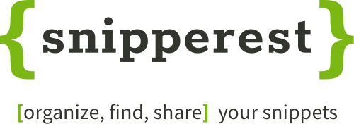

# snipperest

## Description
Snipperest is a code snippets manager which allows the users to create and organize their code snippets, and discover new snippets from other users.

## Technologies used
The following technologies which were used in this app:

### Backend
- **Node.js** as a run-time enviroment.
- **Express** as a web framework.
- **Passport** as an authentication middleware.
- **Handlebars** as a templating engine.
- **MongoDB** as a database engine.
- **Mongoose** as an ORM.

### Frontend
- The styling is done with Saas language, without any CSS framework.
- [Codemirror](https://codemirror.net/) is used as a code editor and a viewer.
- Login can be done with GitHub or a local account.

## Try it
You can try Snipperest [here](https://codemirror.net/). 

### Be careful! 
Please, keep in mind that this is not the final product (yet), so you shouldn't save important information here. Our database could be modified or removed at any given moment.
